# Generador de portfolios

Este proyecto se basa en crear una aplicación capaz de crear portfolios en base a la información solicitada para cada perfil de usuario automatizando la tarea de crear desde cero un diseño y estructuramiento de cada sección de información.

## Secciones

-   [Requisitos](#requisitos)
-   [Caracteristicas](#caracteristicas)
-   [Tecnologias utilizadas](#tecnologias-utilizadas)
-   [Como funciona](#como-funciona)
    -   [Explicación textareas](#explicación-textareas)
    -   [Explicación botones](#explicación-botones)
-   [Uso de App](#uso-de-app)
-   [Screenshots](#screenshots)

## Requisitos

1. Primero que todo debes tener instalado Node, en caso de no tenerlo instalado descarga la version **LTS** de la pagina oficial https://nodejs.org/es.

2. Una vez instalado asegurate de tener npm incorporado en tu sistema **(al instalar Node por defecto se instala)** para eso puedes abrir la terminal y ejecutar el comando `npm -v`.

3. Tener un entorno de ejecución de código como **Visual Studio Code**

## Caracteristicas

**La aplicación permite:**

-   Registro de nuevos perfiles
-   Modificación de perfiles
-   Eliminación de perfiles

**Visualizar relaciones entre:**

-   Sobre mí
-   Educación
-   Experiencias
-   Lenguajes de programación
-   Hobbies
-   Emails
-   Telefonos
-   Idiomas
-   Redes sociales

## Tecnologias utilizadas

- HTML
- CSS
- JavaScript (ES6)
- Node

## Como funciona

-   Al iniciar la aplicación la primera pagina por defecto sera la de creación de portfolios y los registros existentes:

    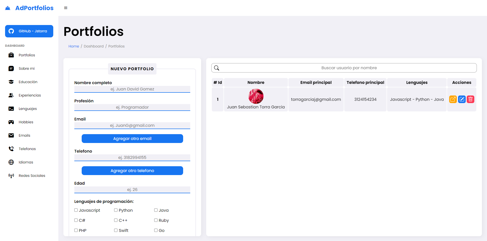

-   En la parte izquierda tenemos una sidebar la cual nos permitira movernos por las diferentes páginas que posee la aplicación, las cuales son: **Portfolios _(principal)_**, **Sobre mí**, **Educación**, **Experiencias**, **Lenguajes de programación _(Habilidades)_**, **Hobbies**, **Emails**, **Telefonos**, **Idiomas** y **Redes sociales**:

    <div align="center">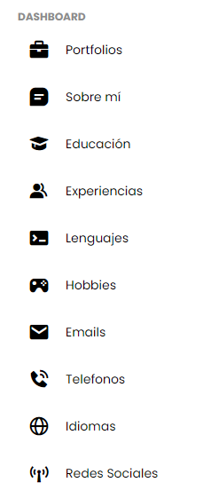</div>

-   Despues nos encontraremos con el formulario para registrar un nuevo portfolio los datos exigidos son:

    -   Nombre completo
    -   Profesión
    -   Email **(posibilidad de agregar mas)**
    -   Telefonos **(posibilidad de agregar mas)**
    -   Edad
    -   Lenguajes de programación **(Habilidades)**
    -   Sobre mí
    -   Educación
    -   Experiencia
    -   Hobbies
    -   Idiomas **(posibilidad de agregar mas)**
    -   Imagen de perfil
    -   Redes sociales

        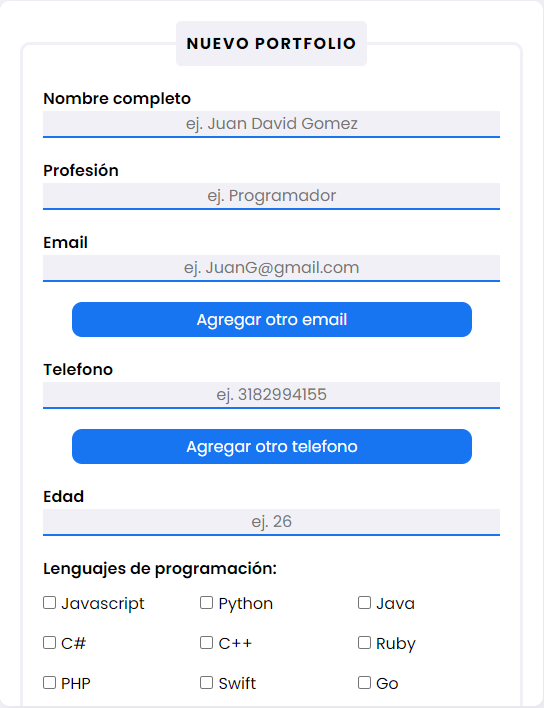

    -   Una vez completados los campos de información en la parte inferior estara el boton de guardar:

        

-   Por ultimo estara la tabla con todos los registros existentes en el momento, cabe mencionar que solo se mostraran el **ID** del usuario o perfil, **Nombre**, **Email principal _(Se toma el primer correo registrado)_**, **Telefono principal _(Se toma el primer telefono registrado)_**, **Lenguajes de programación _(Habilidades)_** y por ultimo las **Acciones**:

    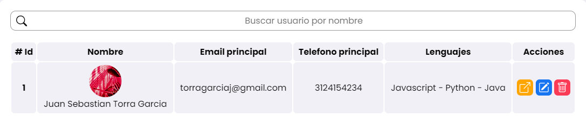

    Resaltar que todas las tablas en la aplicación incluyen un filtro por **"nombre de usuario"** para facilitar la navegación por la misma:

    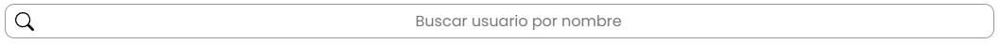

### Explicación textareas

Las textareas incluidas en el formulario de registro de nuevo portfolio como lo son **Sobre mí**, **Educación**, **Experiencia** y **Hobbies** estan programadas para detectar saltos de linea y cada salto de linea representara un nuevo parrafo, una nueva educación, una nueva experiencia, un nuevo hobbie, etc. Asegurate de no realizar saltos de linea a menos que quieras que sea considerado como un nuevo elemento.

### Explicación botones

-   **BOTONES DE AGREGAR**

    -   **Agregar Email:** Permite ingresar un nuevo email añadiendo un nuevo input, en caso de querer eliminar un correo o no querer ingresar uno nuevo simplemente deja el espacio vacío.

        

    -   **Agregar Telefono:** Permite ingresar un nuevo telefono añadiendo un nuevo input, en caso de querer eliminar un telefono o no querer ingresar uno nuevo simplemente deja el espacio vacío.

        

    -   **Agregar Idioma:** Permite ingresar un nuevo idioma añadiendo un nuevo input, en caso de querer eliminar un idioma o no querer ingresar uno nuevo simplemente dejalo en **"Seleccionar un idioma"**.

        

-   **BOTONES DE ACCIÓN**

    

    -   **Boton color naranja (desplegar):** Permite desplegar el portfolio para visualizar su contenido.
    -   **Boton color azul (editar):** Permite actualizar el registro seleccionado, al darle click los datos se insertaran en el formulario, una vez hecho los cambios en la parte inferior aparecera el boton de **"Actualizar"** para guardar los nuevos cambios:

        

        En caso de no querer actualizar solamente recarga la página.

    -   **Boton color rojo (eliminar):** Permite eliminar el registro seleccionado, al darle click todos los datos incluido el portfolio se eliminara permanentemente **(asegurate de querer realizar esta acción)**.

## Uso de App

1. Clona este repositorio en tu máquina local:

    ```bash
    git clone https://github.com/jstorra/generador-portfolio.git
    ```

2. Ejecuta el comando `npm i` para instalar las dependencias necesarias para el funcionamiento del aplicativo.

3. Ejecuta el comando `npm run dev` para levantar el servidor y guardar los registros en el archivo `db.json`.

4. Abre el archivo `index.html` en tu navegador web para ver el generador de portfolios en acción.

## Screenshots

<div align="center">
    <h3 align="center">Portfolios</h3>
    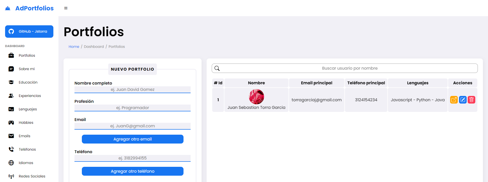
    <h3 align="center">Sobre mí</h3>
    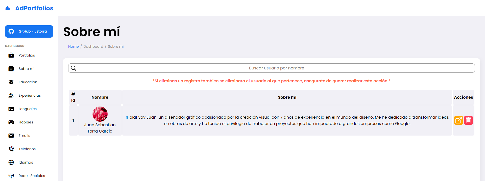
    <h3 align="center">Educación</h3>
    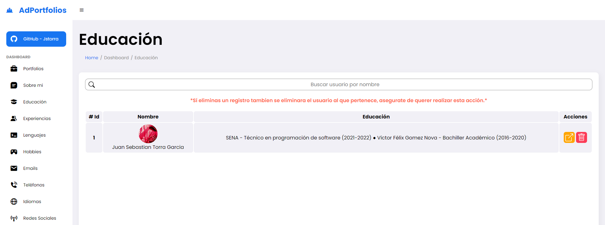
    <h3 align="center">Experiencias</h3>
    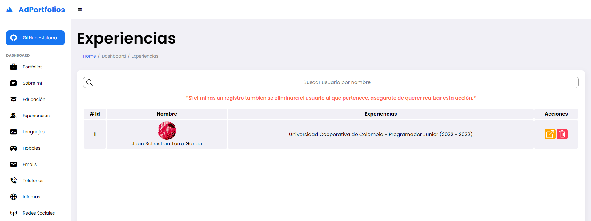
    <h3 align="center">Lenguajes</h3>
    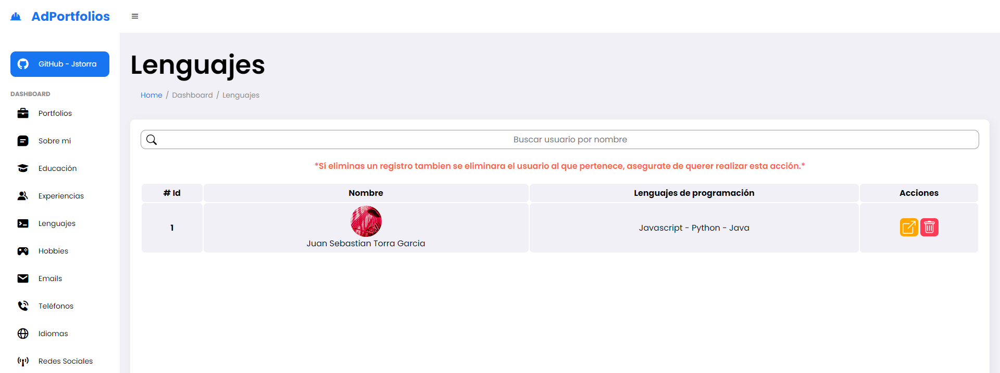
    <h3 align="center">Hobbies</h3>
    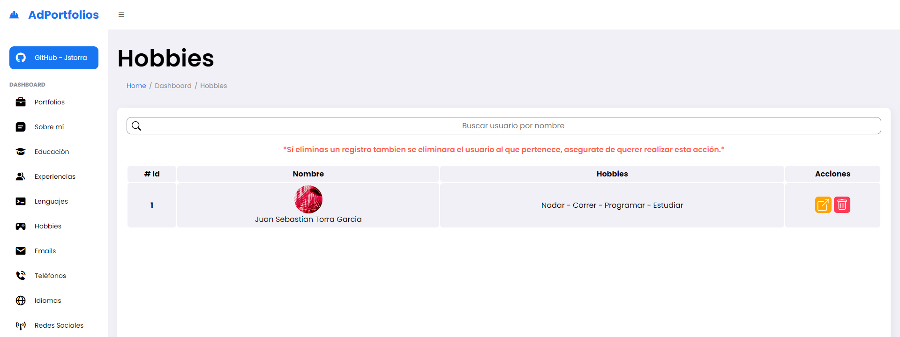
    <h3 align="center">Emails</h3>
    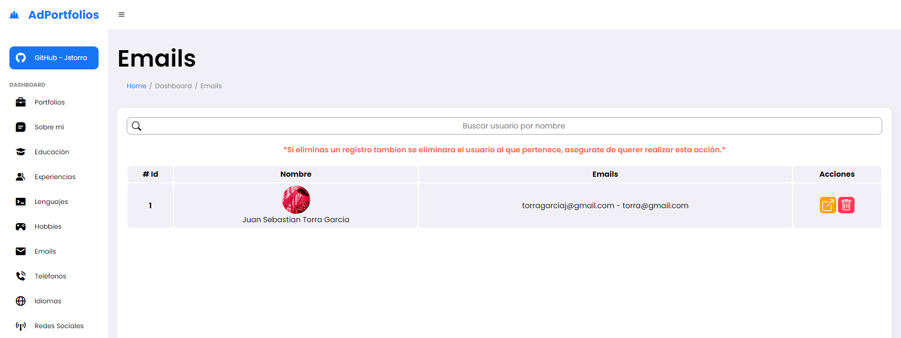
    <h3 align="center">Teléfonos</h3>
    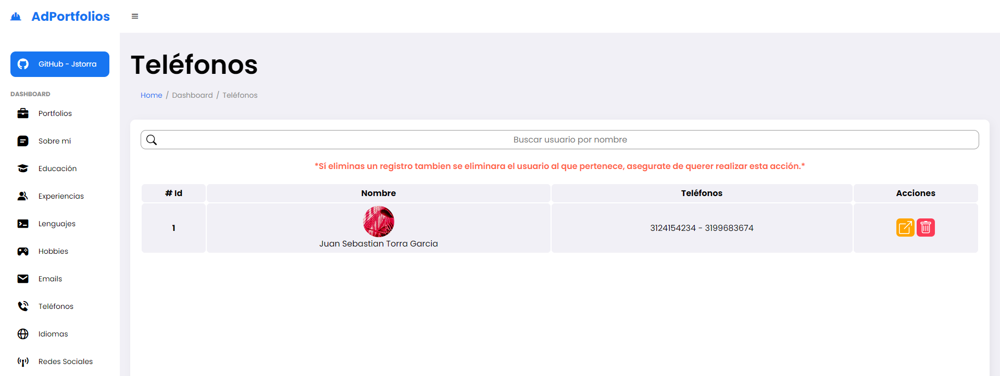
    <h3 align="center">Idiomas</h3>
    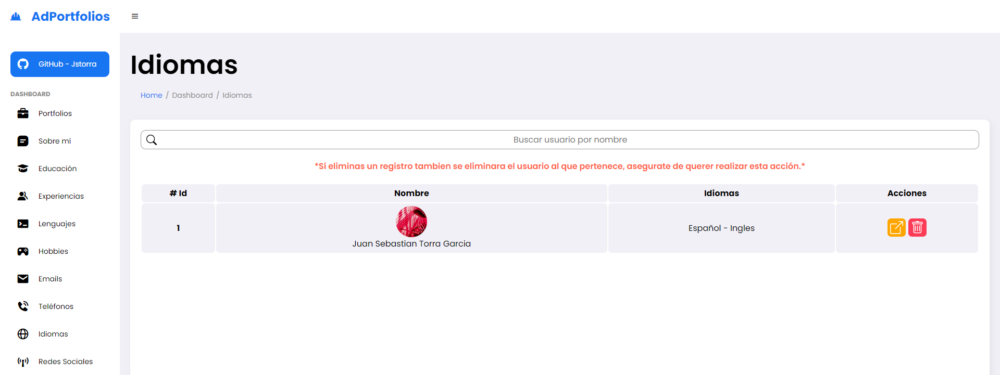
    <h3 align="center">Redes sociales</h3>
    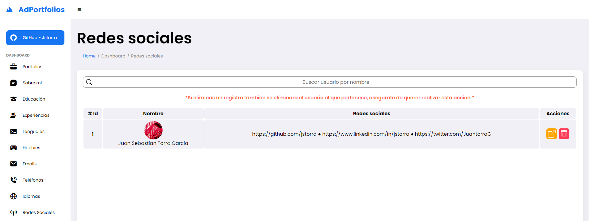
</div>

---

<p align="center">Developed by <a href="https://github.com/jstorra">@jstorra</a></p>
